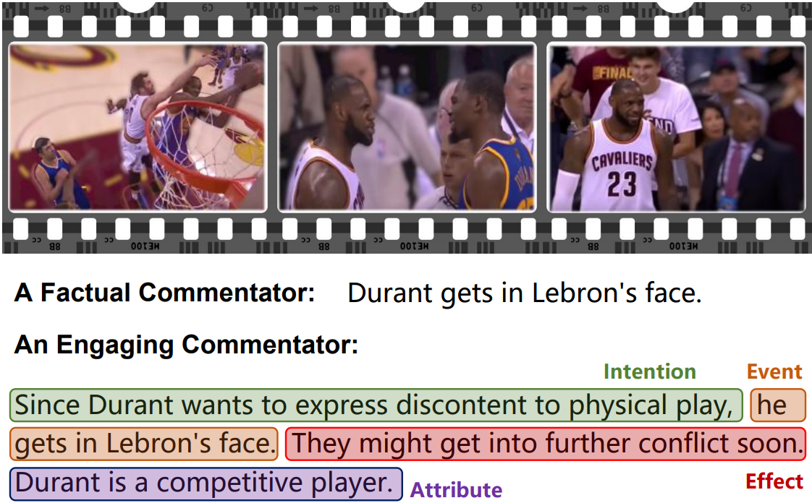
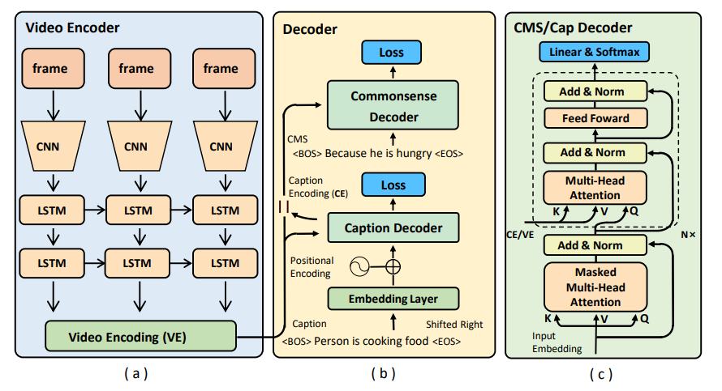

# V2C: Understanding the Video by Enriching Captions with Commonsense Knowledge.
 


## Introduction

This repository contains source code for our **EMNLP-20 Long paper**: [Video2Commonsense: Generating Commonsense Descriptions to Enrich
Video Captioning](https://arxiv.org/pdf/2003.05162.pdf).
We present the first work on generating commonsense captions directly from videos, to
describe latent aspects such as intentions, effects, and attributes. We present a new dataset
“Video-to-Commonsense (**V2C**)” that contains
∼ 9k videos of human agents performing various actions, annotated with 3 types of commonsense descriptions. 
For more demos, information about this project, see the [V2C Website](https://asu-active-perception-group.github.io/Video2Commonsense/).

## Task Overview
Given the off-the-shelf video representations **V**, traditional video captioning task aims to produce the textual descriptions **T**. In addition to just generate the factual aspects of the observable videos, V2C aims to produce the hidden commonsense knowledge **C**, along with the captions. This is possible because of our curated V2C dataset originated from MSR-VTT video captioning dataset, by further labeling the complementary commonsense aspects per caption (*i.e.*, intentions, future effects and attributes of the person). V2C proves that, when provided proper annotations, data-driven model is able to infer out the plausible pre-conditions or expected results of certain human activities. This provides a novel yet un-investigated perspective for video understanding challenges. 

We identified 3 tasks in V2C, namely:

*V2C-Completion*, given video **V** and ground-truth caption **T**, produce **C**.

*V2C-Generation*, given video **V**, produce caption **T** along with **C**.

*V2C-QA*, given video **V** and a textual question **Q**, predict the answers as a VQA task.

This repo provides only the implementations for *V2C-Completion* task while the generic architecture allows the user to expand to other tasks easily.


## V2C Dataset
We released the V2C dataset in [V2C_annotations.zip](https://drive.google.com/file/d/1qt0JsOAqBsdCTlDUw0gw7c_IosShysoW/view?usp=sharing), which consists:
    
    V2C_annotations.zip
    ├── msrvtt_new_info.json                      # MSR-VTT captions and token dictionary.
    ├── v2c_info.json                             # V2C Raw, captions/CMS, and token dictionary.
    ├── V2C_MSR-VTT_caption.json                  # V2C Raw, captions/CMS after tokenization.
    ├── train_cvpr_humanRank_V2C_caption.json     # a human re-verified clean split for V2C annotations.
    └── v2cqa_v1_train.json                       # for V2C QA, consisting captions, CMS, and CMS related questions/answers.

Note: 
We use V2C raw split for V2C-Completion task and auto-evaluations;
We provide a small scale but human re-verified V2C anntations (see above) with less noises for future video retrieval, human evaluation, or other related tasks;

## Video Features
We use the most naive [ResNet-152 frame-wise video representations](https://drive.google.com/file/d/1yUu4zMQzw_YOO5M8_i91ht3PmfkytolG/view?usp=sharing) from MSR-VTT dataset. 

NOTE: By using more advanced video features, *e.g.*, I3D or S3D can yield obvious performance boost but is not the objective for this work. Similarly, we suggest users to apply ``self-criti'' strategy after first-round training for better CIDER performances.

## Architecture

<p align="center">
   
</p>

## Training and Testing
Enviroment: This implementation was complemented on PyTorch-1.1.0, there was reported some errors if newer version PyToch is usednad  we will work on a updation for that later.

Before the training on V2C-completion task, organize the working directory as follows using previous features/annotations:

    Video2CommonsenseBaseline
    ├── data                      
    │   ├── feats
    │   │   ├── resnet152
    │   ├── msrvtt_new_info.json                     
    │   ├── v2c_info.json                             
    │   ├── V2C_MSR-VTT_caption.json                  
    │   ├── train_cvpr_humanRank_V2C_caption.json     
    │   └── v2cqa_v1_train.json                       
    ├── model
    ├── save                                          # for log/checkpoint output
    ├── pycocoevalcap                                 # COCO official evaluation scripts
    ├── utils
    ├── train.py  
    ├── opts.py     
    └── test.py                      

E.g., to initiate a training on **intention** prediction tasks (set --cms 'int'), with 1 RNN video encoder layer, and 6 transformer decoder layers with 8 attention heads, 64 head dim, and 1024 model dim, for 600 epochs under CUDA mode, and shows intermedia generation examples:
```python
python train.py --cms 'int' --batch_size 128 --epochs 600 --num_layer 6 --dim_head 64 --dim_inner 1024 \ 
                --num_head 8 --dim_vis_feat 2048 --dropout 0.1 --rnn_layer 1 --checkpoint_path ./save \ 
                --info_json data/v2c_info.json --caption_json data/V2C_MSR-VTT_caption.json \ 
                --print_loss_every 20 --cuda --show_predict
```

For evaluations:
```python
python test.py  --cms 'int' --batch_size 64 --num_layer 6 --dim_head 64 --dim_inner 1024 \ 
                --num_head 8 --dim_vis_feat 2048 --dropout 0.1 --rnn_layer 1 --checkpoint_path ./save \ 
                --info_json data/v2c_info.json --caption_json data/V2C_MSR-VTT_caption.json \
                --load_checkpoint save/XX/XX.pth --cuda 
```

For time efficiency, we just used 1 caption per video during testing, but find close results when applied 10*3k video-caption pairs.
Optimum parameters are to be decided after grid searching, but for the numbers in paper and pre-trained models:

## Model Zoo
Download [MODEL_ZOO.zip](https://drive.google.com/drive/folders/1XMteYdtw0UXlqCnTKozkJR5WQbvtd1ba?usp=sharing) for the trained captioning models for intention, effects and attributes generations.

To reproduce the number:
```python
python test.py  --cms 'int' --batch_size 64 --num_layer 6 --dim_head 64 --dim_inner 1024 \ 
                --num_head 8 --dim_vis_feat 2048 --dropout 0.1 --rnn_layer 1 --checkpoint_path ./save \ 
                --info_json data/v2c_info.json --caption_json data/V2C_MSR-VTT_caption.json \
                --load_checkpoint save/model_cap-int.pth --cuda 
```

Relation | CIDER |  PPL  |   B1   |   B2   |   B3   |   B4   |   METEOR   |   ROUGE-L  | 
---------|-------|-------|--------|--------|--------|--------|------------|------------|
Attribute|   -   |   -   |     -  |     -  |   47.3 |     -  |       -    |       -    |
  Effect |  37.3 |  15.6 |   34.8 |   25.9 |   22.5 |   20.4 |     20.8   |     30.6   |
Intention|  62.0 |  11.7 | 60.8   |   48.4 |   39.1 |   34.1 |     28.5   |     54.6   |


## Citations
Please consider citing this paper if you find it helpful:
```
@inproceedings{fang-etal-2020-video2commonsense,
    title = "{V}ideo2{C}ommonsense: Generating Commonsense Descriptions to Enrich Video Captioning",
    author = "Fang, Zhiyuan  and
      Gokhale, Tejas  and
      Banerjee, Pratyay  and
      Baral, Chitta  and
      Yang, Yezhou",
    booktitle = "Proceedings of the 2020 Conference on Empirical Methods in Natural Language Processing (EMNLP)",
    month = nov,
    year = "2020",
    address = "Online",
    publisher = "Association for Computational Linguistics",
    url = "https://www.aclweb.org/anthology/2020.emnlp-main.61",
    doi = "10.18653/v1/2020.emnlp-main.61",
    pages = "840--860",
}
```

## Authors:
[(Jacob) Zhiyuan Fang](http://www.public.asu.edu/~zfang29/), [Tejas Gokhale](https://www.public.asu.edu/~tgokhale/), [Pratyay Benerjee](https://pratyay-banerjee.github.io/), [Chitta Baral](http://www.public.asu.edu/~cbaral/), [Yezhou Yang](https://yezhouyang.engineering.asu.edu/)

Contact: zy.fang at asu.edu

## License
Oscar is released under the MIT license. See [LICENSE](LICENSE) for details. 

